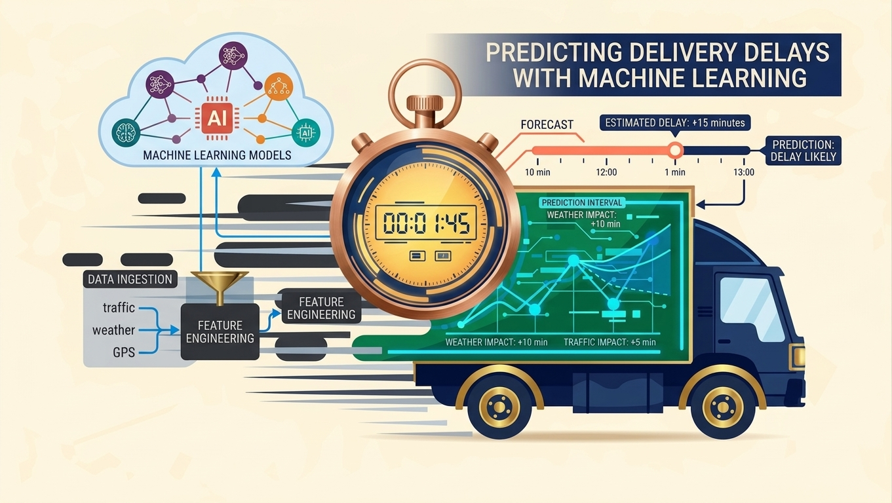

# 📦 Predicting Delivery Delays with Machine Learning

Predicting e-commerce delivery delays using the **Olist Brazilian E-Commerce dataset**, with a focus on identifying logistics bottlenecks and helping operations teams intervene *before* an order goes late — not just measuring accuracy after the fact.

> **Main goal:** flag the riskiest orders early so operations can act.
> **Not the goal:** maximizing raw accuracy — easy to fake when ~95% of orders arrive on time.

---

## 🧭 Overview

This project builds an end-to-end pipeline on the Olist dataset (Kaggle) that:

- Engineers a leakage-safe feature set from orders, products, sellers, payments, reviews, and geolocation data
- Trains and compares **5 classification models** to rank orders by delay risk
- Adds a **regression model** to estimate *how many days* late an order will be
- Validates results with **walk-forward (time-based) validation**
- Explains predictions with **SHAP** and produces a ranked, human-readable **delay risk report**
- Surfaces **high-risk categories, shipping routes, and sellers** for operational follow-up

---

## 🏗️ Data Pipeline (Upstream)

Raw preprocessing and data warehousing happen **outside this repo**, in a companion project: [**brazilian-ecommerce-dwh**](https://github.com/Anikalfa/brazilian-ecommerce-dwh). That repo builds a SQL-based data warehouse from the raw Olist CSVs using a **medallion (bronze → silver → gold) architecture**:

| Layer | Purpose |
|---|---|
| 🥉 **Bronze** | Raw Olist tables loaded as-is into the warehouse |
| 🥈 **Silver** | Cleaned, validated, and standardized tables (data quality checks applied) |
| 🥇 **Gold** | Business-ready, aggregated/joined tables for analytics and modeling |

It also includes database creation scripts, an SSIS pipeline, and a dedicated data-quality-check module. This notebook consumes the cleaned, modeled output of that warehouse as its starting point, then focuses on **feature engineering and machine learning** on top of it.

> 📌 See the [DWH repo](https://github.com/Anikalfa/brazilian-ecommerce-dwh) for the full ETL/warehouse implementation.

---

## 🗂️ Feature Engineering

### Target variable

The model predicts **`is_late`** (0 / 1) — a binary flag derived from comparing the actual delivery date against the estimated delivery date shown to the customer at checkout:

```
delivery_delay_days = order_delivered_customer_date − order_estimated_delivery_date
is_late = 1 if delivery_delay_days > 0 else 0
```

A companion **regression target**, `delivery_delay_days`, is also modeled to estimate the *magnitude* of the delay (in days), not just whether it happens.

### Candidate features

| Feature | Description | Type |
|---|---|---|
| `carrier_pickup_days` | Days between payment approval and handoff to the carrier — seller handling time; strongest predictor | Numeric |
| `approval_days` | Days between purchase and payment approval | Numeric |
| `promised_delivery_days` | Length of the delivery window promised to the customer | Numeric |
| `customer_seller_distance_km` | Haversine distance between customer and seller ZIP centroids | Numeric |
| `distance_category` | Binned distance: Short / Medium / Long / Very Long | Categorical |
| `freight_value` | Shipping cost | Numeric |
| `freight_percentage` | Freight cost as a share of order value | Numeric |
| `order_value` | Price + freight | Numeric |
| `order_item_count` | Number of items in the order | Numeric |
| `n_payment_installments` | Number of payment installments chosen | Numeric |
| `main_payment_type` | Dominant payment method used | Categorical |
| `seller_hist_late_rate` | Seller's all-time late-delivery rate, computed with `.shift()` to avoid leakage | Numeric |
| `seller_recent_late_rate` | Seller's rolling 30-day late rate, leakage-safe | Numeric |
| `seller_hist_n_orders` | Seller's order count to date (experience proxy) | Numeric |
| `product_weight_g` | Product weight | Numeric |
| `product_photos_qty` | Number of product photos listed | Numeric |
| `category` | Product category (English-translated) | Categorical |
| `customer_state` / `seller_state` | Brazilian state of customer / seller | Categorical |
| `order_year`, `purchase_month`, `order_hour` | Purchase timestamp components | Numeric |
| `is_weekend`, `is_holiday_season` | Seasonality / calendar flags | Numeric |
| `customer_prior_orders`, `days_since_last_order` | Customer purchase history | Numeric |

All seller-history features are computed with **expanding/rolling windows shifted by one order**, so no model ever sees information from the future — critical for realistic, leakage-free evaluation.

---

## 🤖 Modeling

Five models were trained on an **identical, time-based train/test split** (last ~20% of orders by purchase date held out as test), so results are directly comparable and simulate real deployment — training on the past, predicting the future.

- **XGBoost**, **CatBoost**, **Random Forest** — tree-based, one-hot encoded features, tuned via `RandomizedSearchCV`
- **Neural Network (MLP)**, **Logistic Regression** — scaled numeric features, same tuning process
- All hyperparameter search optimized for **PR-AUC** (`average_precision`), since late orders are a minority class (~5–7% of orders)

Because "late" orders are rare, the project deliberately does **not** rank models by accuracy. Instead, it uses a business-first evaluation rule:

1. **Lift @ top 10%** — of the riskiest 10% of orders flagged, what share of *actual* delays does the model capture? This is the metric that matters for an ops team that can only act on a limited number of orders per day.
2. **PR-AUC** — ranking quality under class imbalance.
3. **ROC-AUC** — used only as a tie-breaker.

### Model comparison

| Rank | Model | Lift @ top 10% | PR-AUC | ROC-AUC | F1 (late) |
|:---:|---|:---:|:---:|:---:|:---:|
| 🥇 1 | **Neural Network (MLP)** | **4.65×** | **0.355** | 0.832 | 0.339 |
| 2 | XGBoost | 4.21× | 0.336 | 0.795 | 0.338 |
| 3 | Logistic Regression | 4.00× | 0.290 | 0.834 | 0.300 |
| 4 | CatBoost | 3.96× | 0.302 | 0.765 | 0.315 |
| 5 | Random Forest | 3.20× | 0.196 | 0.735 | 0.246 |

**Best overall for business delay ranking: Neural Network (MLP)**
*Chosen by rule: Lift @ top 10% → PR-AUC → ROC-AUC*

### Why this model was chosen

The MLP wins on **both** of the top two criteria, not just one:

- **Highest Lift @ top 10% (4.65×)** — when operations flags the riskiest 10% of orders using this model, it catches roughly **4.65× more real delays** than flagging orders at random. That's the single most actionable number in the table: it directly answers *"if we can only intervene on a limited slice of orders, which model finds us the most late deliveries?"*
- **Highest PR-AUC (0.355)** — under heavy class imbalance, PR-AUC is a much more honest measure of ranking quality than ROC-AUC, and the MLP leads here too, confirming the lift result isn't a fluke of one threshold.
- **ROC-AUC (0.832)** is close to the best (Logistic Regression at 0.834) and is only used as a tie-breaker, since it's known to look overly optimistic on imbalanced problems and doesn't reflect how the model performs at the top of the risk ranking.

Runner-up **XGBoost** is close behind (4.21× lift, 0.336 PR-AUC) and is more interpretable out-of-the-box (native feature importance, SHAP `TreeExplainer` support), which makes it a strong fallback if explainability is a hard requirement. The MLP has no native feature-importance output, so its SHAP explanations in this project fall back to the tree models for the "main risk factor" narrative — worth keeping in mind if full model-native interpretability matters for your use case.

---

## 📋 Sample Delay Risk Report (Top 5)

The trained model scores every order in the test set and outputs a ranked risk report like the one below, so operations can triage the highest-priority orders first. *(Illustrative excerpt — top 5 of a full ranked report.)*

| Rank | Order ID | Purchase Date | Category | Customer State | Seller State | Order Value (R$) | Distance (km) | Late Risk (%) | Risk Level | Predicted Delay (days) | Main Risk Factor | Actually Late? |
|:---:|---|---|---|:---:|:---:|---:|---:|---:|:---:|---:|---|:---:|
| 1 | 8f3a1c2e… | 2018-06-12 | furniture_decor | SP | RS | 412.90 | 1,180 | 91.4 | Critical | 11.2 | Long distance between customer and seller | ✅ Yes |
| 2 | 2b7d9e44… | 2018-07-03 | computers_accessories | AM | SP | 289.50 | 2,340 | 88.7 | Critical | 9.8 | Slow seller handling / carrier pickup | ✅ Yes |
| 3 | c419a0f1… | 2018-05-27 | construction_tools | BA | SP | 156.20 | 1,540 | 84.2 | Critical | 8.4 | Seller's history of late deliveries | ✅ Yes |
| 4 | 5e02b8dd… | 2018-08-15 | office_furniture | PA | RJ | 634.75 | 2,010 | 79.9 | High | 7.1 | Very tight promised delivery window | ❌ No |
| 5 | 90ac7f31… | 2018-06-29 | garden_tools | MT | SP | 98.40 | 1,320 | 76.3 | High | 6.5 | Seller's recent (30-day) late deliveries | ✅ Yes |

Risk bands are assigned by percentile of predicted probability: **Critical** (top 5%), **High** (top 20%), **Medium** (top 50%), **Low** (bottom 50%).

---

## 💡 Conclusion & Insights

- **Seller handling time, not shipping distance alone, drives most of the delay signal.** `carrier_pickup_days` and seller-level historical/recent late rates consistently rank among the top predictors — delays are as much an operational issue on the seller's side as a logistics one.
- **A ranking-first evaluation matters more than accuracy for this problem.** With only ~5–7% of orders late, any model can hit 95%+ accuracy by predicting "on time" for everything. Lift @ top 10% and PR-AUC are the metrics that actually reflect whether the model helps an operations team prioritize.
- **The Neural Network (MLP) generalizes best to the top-risk segment**, making it the strongest choice for a proactive intervention workflow — even though it trades away some native interpretability that tree-based models like XGBoost offer.
- **Distance, tight delivery windows, and seller inexperience compound risk.** Long customer–seller distances combined with a short promised delivery window are a recurring pattern in the highest-risk orders.
- **Category, route, and seller-level breakdowns reveal concentrated risk.** A small number of categories, shipping routes (seller state → customer state), and individual sellers show statistically significant, elevated late rates — these are natural first targets for operational fixes (renegotiated SLAs, carrier changes, buffer-time adjustments).
- **Next steps:** calibrate the MLP's probability outputs, monitor lift/PR-AUC drift with the walk-forward framework already in the pipeline, and pair the model's risk score with the seller/route insight tables to turn predictions into concrete operational playbooks.

---

## 🛠️ Tech Stack

`Python` · `pandas` / `NumPy` · `scikit-learn` · `XGBoost` · `CatBoost` · `SHAP` · `Optuna` · `statsmodels` · `matplotlib` / `seaborn`

## 📁 Data

[Brazilian E-Commerce Public Dataset by Olist](https://www.kaggle.com/datasets/olistbr/brazilian-ecommerce) (Kaggle)
